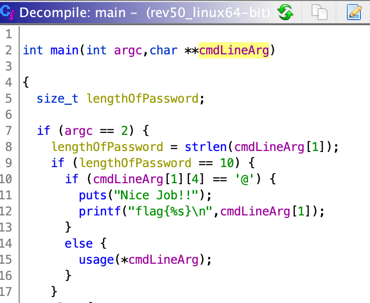

## https://crackmes.one/

Name | easy_reverse 
--|--
Author  |  cbm-hackers
Level  |  1

#### Answer
```
$ ./rev50 blah@blah1
Nice Job!!
flag{blah@blah1}
```
#### Run
```
$ ./rev50 blah
USAGE: ./rev50 <password>
try again!
```
#### Strings
```
$ rabin2 -qz rev50_linux64-bit
0x2004 22 21 USAGE: %s <password>\n
0x201a 11 10 try again!
0x2025 11 10 Nice Job!!
0x2030 10 9 flag{%s}\n
```
#### Symbols
```
[0x00001080]> is~FUNC
< cut down >
061 0x000011c4 0x000011c4 GLOBAL   FUNC  169 main
062 0x0000118a 0x0000118a GLOBAL   FUNC   58 usage
067 0x00001000 0x00001000 GLOBAL   FUNC    0 _init
002 0x00001030 0x00001030 GLOBAL   FUNC   16 imp.puts
003 0x00001040 0x00001040 GLOBAL   FUNC   16 imp.strlen
004 0x00001050 0x00001050 GLOBAL   FUNC   16 imp.printf
```
#### Ghidra's Decompile Window
Look at the `main` function:
```
undefined8 main(int param_1,undefined8 *param_2)

{
  size_t sVar1;

  if (param_1 == 2) {
    sVar1 = strlen((char *)param_2[1]);
    if (sVar1 == 10) {
```
Select `Edit Function Signature` by right-clicking on the Function Name in the `Decompile` window.


Set the correct `method signature`.

Do the same for `variables`. Then you get an easy to read function:



### References
https://www.youtube.com/watch?v=fTGTnrgjuGA
